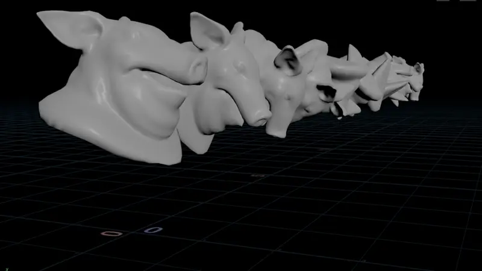
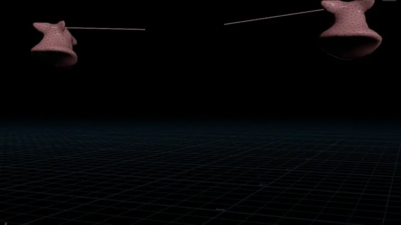
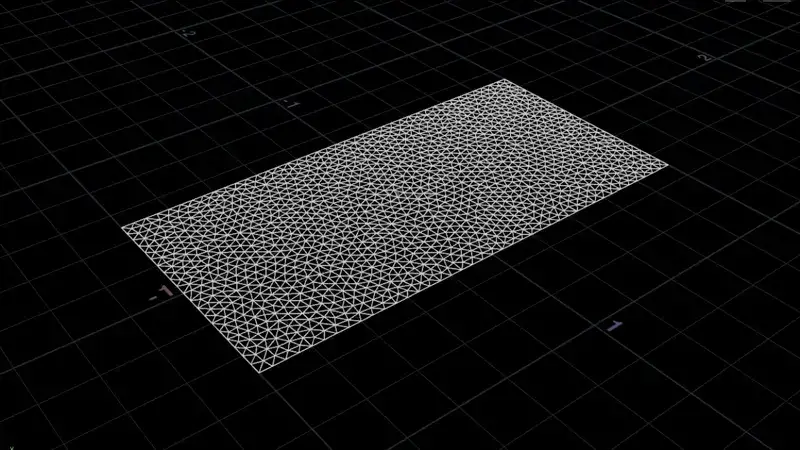
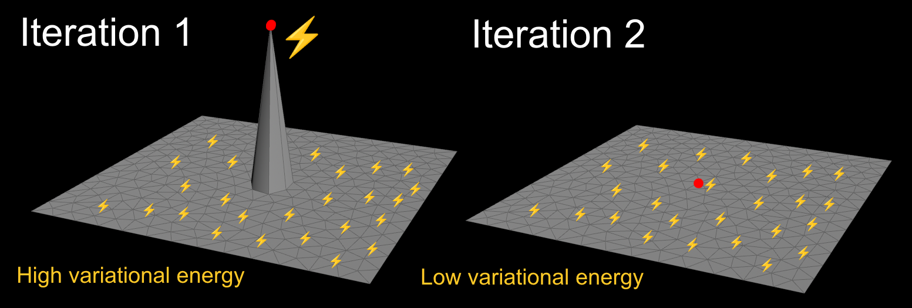

# Houdini Augmented Vertex Block Descent

</img>
</img>
</img>
</img>

WIP of Vertex Block Descent (VBD) in Houdini. It runs natively without plugins, as god intended.

It's a full rewrite in OpenCL based on [TinyVBD](https://github.com/AnkaChan/TinyVBD), [Gaia](https://github.com/AnkaChan/Gaia), [NVIDIA Warp](https://github.com/NVIDIA/warp/blob/main/warp/sim/integrator_vbd.py), [AVBD](https://github.com/savant117/avbd-demo2d) and some ideas from the papers.

Now supports the main additions from Augmented Vertex Block Descent (AVBD) too! Note this currently only affects AVBD constraints.

As well as the OpenCL version, there's an old VEX version to show how it works. Both are included in the HIP files.

Thanks to Anka He Chen and Chris Giles for making these open source with permissive licenses!

| [Download the HIP file!](../../releases/latest) |
| --- |

## Todo
- [x] Steal from [TinyVBD](https://github.com/AnkaChan/TinyVBD)
  - [x] [Mass-spring energy definition](https://github.com/AnkaChan/TinyVBD/blob/main/main.cpp#L381) (for strings)
  - [x] [Accelerated convergence method (section 3.8)](https://graphics.cs.utah.edu/research/projects/vbd/vbd-siggraph2024.pdf)
- [ ] Steal from [NVIDIA Warp](https://github.com/NVIDIA/warp)
  - [ ] [StVK energy definition](https://github.com/NVIDIA/warp/blob/main/warp/sim/integrator_vbd.py) (for cloth)
- [ ] Steal from [Gaia](https://github.com/AnkaChan/Gaia)
  - [x] [Neo-hookean energy definition](https://github.com/AnkaChan/Gaia/blob/main/Simulator/Modules/VBD/VBD_NeoHookean.cpp) (for tetrahedrons)
  - [x] Damping
  - [x] Floor collisions
  - [ ] Self collisions
  - [ ] External collisions
  - [x] Friction
- [ ] Steal from [AVBD](https://graphics.cs.utah.edu/research/projects/avbd/)
  - [x] [LDLT decomposition](https://graphics.cs.utah.edu/research/projects/avbd/Augmented_VBD-SIGGRAPH25.pdf) to improve speed
  - [x] [SPD hessian approximation (section 3.5)](https://graphics.cs.utah.edu/research/projects/avbd/Augmented_VBD-SIGGRAPH25.pdf) to improve stability
  - [x] Dual constraint updating
  - [x] [Spring constraints](https://github.com/savant117/avbd-demo2d/blob/main/source/spring.cpp) (WIP, not including rigid rotation)
  - [ ] [Joint constraints](https://github.com/savant117/avbd-demo2d/blob/main/source/joint.cpp)
  - [ ] [Motor constraints](https://github.com/savant117/avbd-demo2d/blob/main/source/motor.cpp)
  - [x] Breaking constraints
  - [ ] Rigid body support
  - [ ] Hard constraints for collisions
  - [ ] Update all existing constraints to AVBD
- [ ] Steal from myself
  - [ ] SDF collisions
- [ ] Touch grass

## What's Vertex Block Descent?

VBD is very similar to Vellum. You might call it Vellum 2.

Vellum uses a technique called [XPBD (Extended Position-Based Dynamics)](https://matthias-research.github.io/pages/publications/XPBD.pdf). XPBD uses constraints to simulate soft body behaviour. Constraints are solved in parallel workgroups (colors) in OpenCL for better performance. Colors are groups of constraints that aren't directly connected.

Cloth is a good example of a soft body. It's easy to bend but hard to stretch. In XPBD this is simulated with distance constraints. Distance constraints try to preserve their rest length. When you stretch or squash a distance constraint, it pulls the points towards the middle until they reach their rest length again. Since shortening one constraint makes others longer, it's an iterative process. It propagates over several iterations until everything converges to the target length.


VBD constraints are similar, but they're defined in terms of energy instead. The goal is reducing overall variational energy by reducing local energy per point. VBD constraints run over each point rather than each primitive, meaning less workgroups (colors) overall. However, each point typically has to loop over its neighbours to compute the energy, so the performance isn't necessarily better. The Graph Color node allows workgroups for points as well as prims, so it works both for VBD and XPBD.



The diagram above is for mass-spring energy, based on the rest length of each edge. In this case it's not so different to XPBD, but the idea of minimizing energy is different to minimizing distance.

Here's a quick comparison between VBD and XPBD:

|  | VBD | Vellum (XPBD) | Advantage | Disadvantage |
| --- | --- | --- | --- | --- |
| **Runs over** | <p align="center">Point colors<br></p> | <p align="center">Colors per constraint<br></p> | Less colors/workgroups, faster for parallel processing | Takes longer to converge for stiff objects, partly because it updates 1 point per iteration instead of 2 (one on each side of the constraint). Not necessarily faster, since each point typically loops over its neighbours |
| **Constraints** | Energy based (eg mass-spring energy or neo-hookean energy) | XPBD based (eg distance constraints) | Better for larger mass ratios | Randomly explodes due to hessian matrix inversion |
| **Iterations** | Gauss-Seidel | Gauss-Seidel (for constraint iterations) and Jacobi (for smoothing iterations) | Reaches a global solution faster | Might be less stable |

The most important part of VBD is the energy definition, but no one seems to agree on this.

I've seen many different energy definitions, including mass-spring (used by [TinyVBD](https://github.com/AnkaChan/Gaia/blob/main/Simulator/Modules/VBD/VBD_MassSpring.cpp) and [AVBD](https://github.com/savant117/avbd-demo2d/blob/main/source/spring.cpp#L40), but [removed from Gaia](https://github.com/AnkaChan/Gaia/blob/main/Simulator/Modules/VBD/VBD_MassSpring.cpp)), StVK (used by [NVIDIA Warp](https://github.com/AnkaChan/Gaia/blob/main/Simulator/Modules/VBD/VBD_MassSpring.cpp)) and neo-hookean (used by [Gaia](https://github.com/AnkaChan/Gaia/blob/main/Simulator/Modules/VBD/VBD_NeoHookean.cpp)).

Currently mass-spring and neo-hookean are supported, StVK is coming soon.

## How does Vertex Block Descent run?

Ignoring collisions, VBD is really just 3 steps. These steps are nearly identical to XPBD apart from the constraints.

### 1. Integrate the positions

Add the velocity to the position (same as Vellum). VBD uses a warmstarting strategy to scale the gravity term below.

```c
// First-order integration
v@pprevious = v@P;
v@P += v@v * f@TimeInc * v@gravity * f@TimeInc * f@TimeInc;
```

| [OpenCL version](./ocl/forwardStep.cl) | [VEX version (outdated)](./vex/forwardStep.c) |
| --- | --- |

### 2. Apply the constraints

The core idea of VBD is updating the position based on force elements and a hessian matrix.

If these are correct, moving the position should reduce the overall variational energy.

> [!CAUTION]
> **This should be run in workgroups based on graph coloring!**
>
> If points move while their neighbours access them (like if running in sequential order), it breaks the assumption used by VBD:
> 
>  > We adjust each vertex separately, assuming the others remain fixed
> 
> This causes growing error each iteration, leading VBD to explode much more than usual.

```c
vector force = 0;
matrix3 hessian = 0;

// Add influences to force elements and hessian
accumulateInertiaForceAndHessian(force, hessian); // Influences due to mass and inertia
accumulateMaterialForceAndHessian(force, hessian); // Influences due to constraints (eg mass-spring or neo-hookean)
accumulateDampingForceAndHessian(force, hessian); // Influences due to damping
accumulateBoundaryForceAndHessian(force, hessian); // Influences due to boundaries (eg floor planes)
accumulateCollisionForceAndHessian(force, hessian); // Influences due to collisions

v@P += force * invert(hessian); // Reduce the variational energy of the system
```

| [OpenCL version](./ocl/solveConstraints.cl) | [VEX version (outdated)](./vex/solveConstraints.c) |
| --- | --- |

### 3. Update the velocities

Update the velocities based on the change in position (same as Vellum).

```c
// First-order velocities
v@v = (v@P - v@pprevious) / f@TimeInc;
```

| [OpenCL version](./ocl/updateVelocity.cl) | [VEX version (outdated)](./vex/updateVelocity.c) |
| --- | --- |

## Why does stiffness have a limit?

Like with Vellum (XPBD), stiff objects are limited by the number of constraint iterations and substeps.

The more constraint iterations and substeps, the more accurately stiff objects are resolved.

VBD also has accelerated convergence method meant to improve convergence for stiff constraints.

It's named "Improve Convergence" in the Advanced tab and disabled by default, as it tends to explode with high values.

AVBD also adds dual solving meant to improve stiffness. This is available for AVBD Spring constraints currently, but it has mixed results.

## Why do collisions not work sometimes?

VBD solves collisions as soft constraints, meaning collisions get added onto the force and hessian like everything else.

In practice this means other forces can overpower collisions. For example, stiffer materials than the ground can penetrate it.

This can be fixed by increasing the stiffness of the ground, or reducing the stiffness of everything else.

AVBD adds hard constraints which should prevent this from happening, but I haven't implemented this for collisions yet.

## Why does it explode randomly?

This solver used to explode every 5 seconds, but now it's much better. Explosions are a common issue with VBD.

As mentioned, VBD involves updating the position based on force elements and a hessian matrix:

```c
v@P += force * invert(hessian); // force and hessian depend on the energy definition, eg mass-spring or neo-hookean
```

`invert(hessian)` is very unstable, so everyone tries to bandaid it in various ways. The [VBD paper](https://graphics.cs.utah.edu/research/projects/vbd/vbd-siggraph2024.pdf) uses the determinant of the matrix:

```c
if (abs(determinant(hessian)) > 1e-7) { // if |det(H𝑖)| > 𝜖 for some small threshold 𝜖
  v@P += force * invert(hessian);
}
```

This helps, but it also explodes when the values gets too large (for example with very stiff constraints).

The new [AVBD paper](https://graphics.cs.utah.edu/research/projects/avbd/Augmented_VBD-SIGGRAPH25.pdf) uses an approximation to make the hessian positive semi-definite. This massively improves the stability and is enabled by default. It's named "Improve Hessian Stability" in the Advanced tab.

## AVBD Q&A

There's a new paper called [Augmented Vertex Block Descent (AVBD)](https://graphics.cs.utah.edu/research/projects/avbd/Augmented_VBD-SIGGRAPH25.pdf). It adds many improvements to VBD.

I asked the authors about some differences I noticed. They responded with lots of useful information. Thanks guys!

### Missing accelerated convergence

Hi Chris, In the original VBD paper and in TinyVBD, they used an acceleration method to improve convergence (Section 3.8). I noticed in AVBD there's no mention of this method. Was it causing too much instability? Thanks!

> Hi,
> Yeah we ended up not using the acceleration from VBD as it was in general kind of unstable and difficult to tune, even with the original VBD method. It would be interesting to explore other acceleration methods as future work though.
> -Chris

> No, we haven't looked into acceleration for AVBD.
> -Cem

### Energy definition used

Hi Chris, I was wondering what type energy you used for constraints? There were multiple used in the VBD paper, including mass-spring, StVK and neo-hookean. It looks like you used mass-spring energy. Is this correct, or did you use neo-hookean? Thanks!

> Hello,
> So you are correct, in our demos we only used a simple spring energy for the deformable examples, as we weren't focused on rehashing what the original VBD paper showed. However, in AVBD, you can use any energy that works in VBD, such as the ones you mentioned. This is because AVBD is purely an extension of VBD. The only thing to keep in mind with those more complex energy types, is that you need to be careful about how you solve each block since their hessians can be indefinite. In general, you can follow the same pattern that AVBD uses for constraint energies. That is, decompose the hessian into an SPD part and a non-SPD part, then use the diagonal lumped approximation proposed in the paper for the non-SPD part.
> Hope that helps!
> -Chris

> No. The AVBD tests we have are for contacts and joints. VBD already covers soft bodies. AVBD makes no changes to that.
> -Cem

### [Previous velocity definition](https://github.com/savant117/avbd-demo2d/issues/4)

> [!NOTE]
> I noticed this while looking into Vellum. Vellum uses 4 variables to track the previous 2 values of position and velocity:
>
> - `@pprevious` (`@P` 1 substep ago)
> - `@plast` (`@P` 2 substeps ago)
> - `@vprevious` (`@v` 1 substep ago)
> - `@vlast` (`@v` 2 substeps ago)
>
> Vellum sets all of these at the start of each substep. They're needed for 1st and 2nd order integration.
>
> However, TinyVBD and AVBD set `@vprevious` in a different place. I thought this was a typo, but turns out it's not.

Hi Chris, I was wondering if the order of these 2 lines is correct?

```cpp
body->prevVelocity = body->velocity; 
if (body->mass > 0) 
   body->velocity = (body->position - body->initial) / dt;
```

It seems like the previous velocity should be set after it gets recalculated, instead of before.

I saw the [same code in TinyVBD](https://github.com/AnkaChan/TinyVBD/blob/main/main.cpp#L349-L350), but I believe it is a mistake. The [opposite code is present in GAIA](https://github.com/AnkaChan/Gaia/blob/main/Simulator/Modules/VBD/VBD_BaseMaterial.h#L256).

> The current code is correct (and probably in TinyVBD as well), since we use prevVelocity to compute an acceleration estimate during the adaptive warmstarting at the beginning of the step:
>
> `float3 accel = (body->velocity - body->prevVelocity) / dt;`
>
> If we switched the order as suggested, then this acceleration would always be zero, and the adaptive warmstart would not help.
