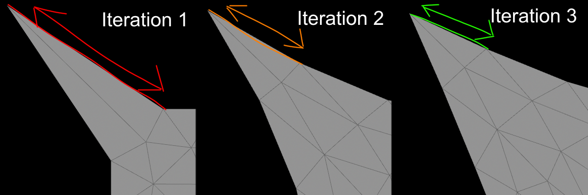
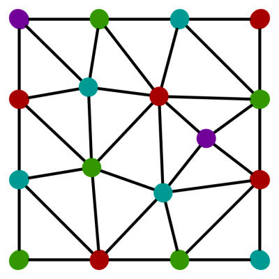
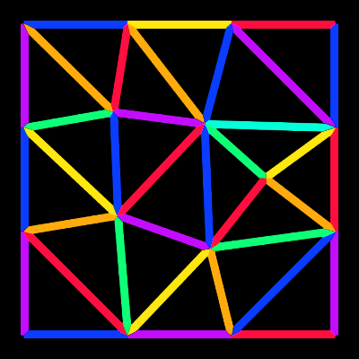

# Houdini Vertex Block Descent


Very early WIP of Vertex Block Descent in Houdini. It runs natively without plugins, as god intended.

There's an OpenCL version for performance, and a VEX version for debugging. Both are included in the HIP files.

Currently it has everything from [TinyVBD](https://github.com/AnkaChan/TinyVBD), which isn't much. TinyVBD (and AVBD) use mass-spring energy.

The current version is very unstable, [it will explode randomly](#why-does-it-explode-randomly).

[Download here!](../../releases/latest)

## Todo
- [x] Steal from [TinyVBD](https://github.com/AnkaChan/TinyVBD)
  - [x] [Simple mass-spring energy definition](https://github.com/AnkaChan/TinyVBD/blob/main/main.cpp#L381)
  - [x] [Accelerated convergence method (section 3.8)](https://graphics.cs.utah.edu/research/projects/vbd/vbd-siggraph2024.pdf)
- [ ] Steal from [full VBD](https://github.com/AnkaChan/Gaia)
  - [ ] [Neo-Hookean energy definition](https://github.com/AnkaChan/Gaia/blob/main/Simulator/Modules/VBD/VBD_NeoHookean.cpp), likely more stable
  - [ ] Damping
  - [ ] Self collisions
  - [ ] External collisions
  - [ ] Friction
- [ ] Steal from [AVBD](https://graphics.cs.utah.edu/research/projects/avbd/)
  - [ ] [LDLT decomposition](https://graphics.cs.utah.edu/research/projects/avbd/Augmented_VBD-SIGGRAPH25.pdf) to improve stability
  - [ ] [Hard constraints](https://graphics.cs.utah.edu/research/projects/avbd/Augmented_VBD-SIGGRAPH25.pdf)
  - [ ] All other improvements
- [ ] Touch grass

## What's Vertex Block Descent?

VBD is very similar to Vellum. You might call it Vellum 2.

Vellum uses a technique called [XPBD (Extended Position-Based Dynamics)](https://matthias-research.github.io/pages/publications/XPBD.pdf). XPBD uses constraints to simulate soft body behaviour. Constraints are solved in parallel workgroups (colors) in OpenCL for better performance. Colors are groups of constraints that aren't directly connected.

Cloth is a good example of a soft body. It's bendy but stiff in terms of edge lengths. In XPBD this is simulated with distance constraints. Distance constraints try to preserve their rest length based on stiffness. When you stretch or squash a distance constraint, it pulls the points towards the middle until they reach their rest length again. Since shortening one constraint makes others longer and vice versa, it's an iterative process. It propagates over several iterations until everything converges to the target length.



VBD constraints are similar, but they're defined in terms of energy instead. They also run over each point rather than each constraint, meaning less workgroups (colors) overall. The Graph Color node allows workgroups for points as well as prims, so it works both for VBD and XPBD.

Here's a quick comparison between VBD and XPBD:

|  | VBD | Vellum (XPBD) | Advantage | Disadvantage |
| --- | --- | --- | --- | --- |
| **Runs over** | <p align="center">Point colors<br></p> | <p align="center">Colors per constraint<br></p> | Less colors/workgroups, better for parallel processing | Takes longer to converge for stiff objects, partly because it updates 1 point per iteration instead of 2 (one on each side of the constraint) |
| **Constraints** | Energy based (eg mass-spring energy or Neo-Hookean energy) | XPBD based (eg distance constraints) | Better for larger mass ratios | Randomly explodes due to hessian matrix inversion |
| **Iterations** | Gauss-Seidel | Gauss-Seidel (for constraint iterations) and Jacobi (for smoothing iterations) | Reaches a global solution faster | Might be less stable |

The most important part of VBD is the energy definition, but no one seems to agree on this.

I've seen many different energy definitions, including mass-spring energy (used by [TinyVBD](https://github.com/AnkaChan/Gaia/blob/main/Simulator/Modules/VBD/VBD_MassSpring.cpp) and [AVBD](https://github.com/savant117/avbd-demo2d/blob/main/source/spring.cpp#L40), but [removed from full VBD](https://github.com/AnkaChan/Gaia/blob/main/Simulator/Modules/VBD/VBD_MassSpring.cpp)), StVK (can't find this anywhere, maybe the same as mass-spring) and Neo-Hookean (used by [full VBD](https://github.com/AnkaChan/Gaia/blob/main/Simulator/Modules/VBD/VBD_NeoHookean.cpp)).

I'm guessing Neo-Hookean energy is best since it was the most used in the paper, but haven't tried it yet.

## Why does it explode randomly?
Great question! This is a problem with VBD in general.

The core of VBD is updating the position based on a force vector and a hessian matrix:
```c
v@P += force * invert(hessian); // force and hessian depend on the energy definition, eg mass-spring or Neo-Hookean
```

`invert(hessian)` is very unstable, so everyone tries to bandaid it in various ways. The [VBD paper](https://graphics.cs.utah.edu/research/projects/vbd/vbd-siggraph2024.pdf) uses the determinant of the matrix:

```c
if (abs(determinant(hessian)) > 1e-7) { // if |det(H𝑖)| > 𝜖 for some small threshold 𝜖
  v@P += force * invert(hessian);
}
```

This helps, but it also explodes when the values gets too large (for example with very stiff constraints).

The new [AVBD paper](https://graphics.cs.utah.edu/research/projects/avbd/Augmented_VBD-SIGGRAPH25.pdf) uses an approximation to make the hessian symmetric positive definite (SPD) to allow LDLT decomposition instead.

Also it probably explodes since I'm using [mass-spring energy](https://github.com/AnkaChan/Gaia/blob/main/Simulator/Modules/VBD/VBD_MassSpring.cpp) instead of [Neo-Hookean](https://github.com/AnkaChan/Gaia/blob/main/Simulator/Modules/VBD/VBD_NeoHookean.cpp) energy. They [removed mass-spring energy](https://github.com/AnkaChan/Gaia/blob/main/Simulator/Modules/VBD/VBD_MassSpring.cpp) from full VBD, likely due to excessive exploding.

## AVBD Q&A

There's a new paper called [Augmented Vertex Block Descent (AVBD)](https://graphics.cs.utah.edu/research/projects/avbd/Augmented_VBD-SIGGRAPH25.pdf). It adds many improvements to VBD.

I asked the authors about some differences I noticed. They responded with lots of useful information. Thanks guys!

### Missing accelerated convergence

Hi Chris, In the original VBD paper and in TinyVBD, they used an acceleration method to improve convergence (Section 3.8). I noticed in AVBD there's no mention of this method. Was it causing too much instability? Thanks!

> Hi,
> Yeah we ended up not using the acceleration from VBD as it was in general kind of unstable and difficult to tune, even with the original VBD method. It would be interesting to explore other acceleration methods as future work though.
> -Chris

> No, we haven't looked into acceleration for AVBD.
> -Cem

### Energy definition used

Hi Chris, I was wondering what type energy you used for constraints? There were multiple used in the VBD paper, including mass-spring, StVK, and Neo-Hookean. It looks like you used mass-spring energy. Is this correct, or did you use Neo-Hookean? Thanks!

> Hello,
> So you are correct, in our demos we only used a simple spring energy for the deformable examples, as we weren't focused on rehashing what the original VBD paper showed. However, in AVBD, you can use any energy that works in VBD, such as the ones you mentioned. This is because AVBD is purely an extension of VBD. The only thing to keep in mind with those more complex energy types, is that you need to be careful about how you solve each block since their hessians can be indefinite. In general, you can follow the same pattern that AVBD uses for constraint energies. That is, decompose the hessian into an SPD part and a non-SPD part, then use the diagonal lumped approximation proposed in the paper for the non-SPD part.
> Hope that helps!
> -Chris

> No. The AVBD tests we have are for contacts and joints. VBD already covers soft bodies. AVBD makes no changes to that.
> -Cem
