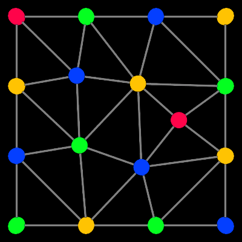
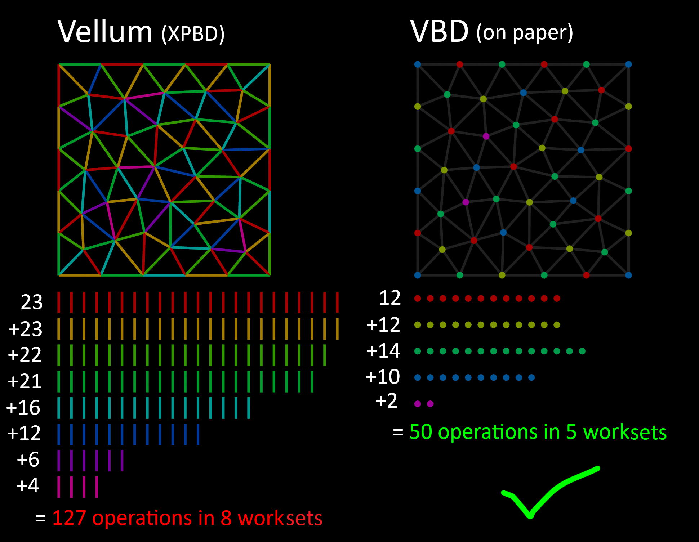

# Houdini Augmented Vertex Block Descent

</img>
</img>
</img>
</img>
<a href="https://youtu.be/VbLSCm5xQ4o">
  
</a>

WIP of Vertex Block Descent (VBD) in Houdini. It runs natively without plugins, as god intended.

I ported it to OpenCL based on all official references ([TinyVBD](https://github.com/AnkaChan/TinyVBD), [Gaia](https://github.com/AnkaChan/Gaia), [NVIDIA Warp](https://github.com/NVIDIA/warp/blob/main/warp/sim/integrator_vbd.py), [AVBD-2D](https://github.com/savant117/avbd-demo2d)).

Now supports stuff from Augmented Vertex Block Descent (AVBD) too! Note this currently affects AVBD constraints only.

As well as the OpenCL version, there's an old VEX version to show how it works. Both are included in the HIP files.

Thanks to Anka He Chen and Chris Giles for making these open source with permissive licenses!

| [Download the HIP file!](../../releases/latest) |
| --- |

> [!CAUTION]
> Self and external collisions are not implemented correctly yet, and are [very buggy](#why-are-collisions-so-bad).
>
> Ground collisions are correct to VBD, but need to be updated to use hard constraints from AVBD.
>
> I'm working on collisions at the moment.

## Features

### From [TinyVBD](https://github.com/AnkaChan/TinyVBD)
  - [x] [Mass-spring constraints](https://github.com/AnkaChan/TinyVBD/blob/main/main.cpp#L381) (for strings)
  - [x] [Accelerated convergence method](https://github.com/AnkaChan/TinyVBD/blob/main/main.cpp#L429) (section 3.8)
  - [x] [Hessian direct inverse](https://github.com/AnkaChan/CuMatrix/blob/main/CuMatrix/MatrixOps/CuMatrix.h#L235)

### From [Gaia](https://github.com/AnkaChan/Gaia)
  - [x] [VBD integration](https://github.com/AnkaChan/Gaia/blob/main/Simulator/Modules/VBD/VBD_BaseMaterial.cpp#L18) (inertia, inertia and acceleration, adaptive)
  - [x] [Neo-hookean constraints](https://github.com/AnkaChan/Gaia/blob/main/Simulator/Modules/VBD/VBD_NeoHookean.cpp) (for tetrahedrons)
  - [x] [General damping](https://github.com/AnkaChan/Gaia/blob/main/Simulator/Modules/VBD/VBDPhysics.cpp#L2786)

### From [NVIDIA Warp](https://github.com/NVIDIA/warp/blob/main/warp/sim/integrator_vbd.py)
  - [x] [Ground collisions](https://github.com/NVIDIA/warp/blob/main/warp/sim/integrator_vbd.py#L513)
  - [x] [Ground friction](https://github.com/NVIDIA/warp/blob/main/warp/sim/integrator_vbd.py#L1188)
  - [x] [Ground damping](https://github.com/NVIDIA/warp/blob/main/warp/sim/integrator_vbd.py#L534)

### From [AVBD-2D](https://github.com/savant117/avbd-demo2d)
  - [x] [Spring constraints](https://github.com/savant117/avbd-demo2d/blob/main/source/spring.cpp) (currently missing rigid rotation)
  - [x] [Joint constraints](https://github.com/savant117/avbd-demo2d/blob/main/source/joint.cpp) (currently missing rigid rotation)
  - [x] [Hard constraints](https://github.com/savant117/avbd-demo2d/blob/main/source/solver.cpp#L181-L191) (adaptive stiffness for AVBD constraint types)
  - [x] [Dual constraint updates](https://github.com/savant117/avbd-demo2d/blob/main/source/solver.cpp#L205)
  - [x] [Breaking constraints](https://github.com/savant117/avbd-demo2d/blob/main/source/solver.cpp#L218)
  - [x] [Hessian LDLT decomposition](https://github.com/savant117/avbd-demo2d/blob/main/source/maths.h#L325)
  - [x] [SPD hessian approximation](https://github.com/savant117/avbd-demo2d/blob/main/source/solver.cpp#L188) (section 3.5)

### From [Vellum (XPBD)](https://www.sidefx.com/docs/houdini/vellum/overview.html)
  - [x] Vellum integration (1st order, 2nd order)
  - [x] Self and external collisions (very buggy, to be replaced soon)
  - [x] Stopped, permanent and animated pin support
  - [x] Custom forces support
  - [x] [Graph coloring](https://www.sidefx.com/docs/houdini/nodes/sop/graphcolor.html)

### From [Otis](https://www.sidefx.com/docs/houdini/nodes/sop/otissolver.html) (if Houdini 21 or above)
  - [x] [Hessian approximation using eigenvalue projection](https://www.cs.columbia.edu/cg/abs-psd/paper.pdf)

## Todo
- [ ] Steal from [NVIDIA Warp](https://github.com/NVIDIA/warp)
  - [ ] [StVK energy definition](https://github.com/NVIDIA/warp/blob/main/warp/sim/integrator_vbd.py) (for cloth)
- [ ] Steal from [Gaia](https://github.com/AnkaChan/Gaia)
  - [ ] Self collisions
  - [ ] External collisions
- [ ] Steal from [AVBD](https://graphics.cs.utah.edu/research/projects/avbd/)
  - [ ] [Motor constraints](https://github.com/savant117/avbd-demo2d/blob/main/source/motor.cpp)
  - [ ] Sticking contacts
  - [ ] Post stabilization
  - [ ] Rigid body support (packed prims)
  - [ ] Hard constraints for collisions
  - [ ] Update all existing constraints to AVBD
- [ ] Steal from myself
  - [ ] SDF collisions
  - [ ] Add bounce for collisions
  - [ ] Stop everything exploding all the time
  - [ ] Convert from HDALC -> HDA
- [ ] Touch grass

## BREAKING NEWS: Otis Solver!

You heard it here first! The [new Otis solver in Houdini 21](https://www.sidefx.com/docs/houdini/nodes/sop/otissolver.html) uses Vertex Block Descent!

They made some nice improvements for stability, including several new hessian approximations. It also runs in chunks of 16 for some reason. They even added new collision handling based on how VBD did it! It's very tempting to steal, but I'll resist the urge for now.

Currently it's specialized for muscle and tissue, so it might be a while until it gets support for rigid bodies (packed prims). I'm planning to add support for this soon, so we'll see who wins!

## What's Vertex Block Descent?

VBD is very similar to Vellum. The main differences are constraints and collisions.

Vellum uses a technique called [XPBD (Extended Position-Based Dynamics)](https://matthias-research.github.io/pages/publications/XPBD.pdf). XPBD uses constraints to simulate soft body behaviour. Constraints are solved in parallel workgroups (colors) in OpenCL for better performance. Colors are groups of constraints that aren't directly connected.

Cloth is a good example of a soft body. It's easy to bend but hard to stretch. In XPBD this is simulated with distance constraints. Distance constraints try to preserve their rest length. When you stretch or squash a distance constraint, it pulls the points towards the middle until they reach their rest length again. Since shortening one constraint makes others longer, it's an iterative process. It propagates over several iterations until everything converges to the target length.


VBD constraints are similar, but they're defined in terms of energy instead. The goal is reducing overall variational energy by reducing local energy per point. VBD constraints run over each point rather than each prim, meaning less workgroups (colors) overall. The Graph Color node allows workgroups for points as well as prims, so it works both for VBD and XPBD.


The image above is for mass-spring energy, based on the rest length like in XPBD. Rather than directly using the rest length, the energy contributions get added to a force gradient and a hessian matrix. Once all the contributions are added, the position gets updated.

```js
vector force = 0;
matrix3 hessian = 0;

// For each connected constraint (and extra forces)
force += constraintGradient;
hessian += constraintHessian;

// Reduce the variational energy of the system
v@P += force * invert(hessian);
```

Here's a comparison between Vellum and VBD:

|  | Vellum (XPBD) | VBD | Advantage | Disadvantage |
| --- | --- | --- | --- | --- |
| **Runs over** | <p align="center">Prim colors<br></p> | <p align="center">Point colors<br></p> | Less colors/workgroups, better for parallelization (in theory) | Takes longer to converge for stiff constraints |
| **Iterations** | Gauss-Seidel (for constraint iterations) and Jacobi (for smoothing iterations) | Gauss-Seidel | Reaches a global solution faster | May introduce jittering |
| **Integration** | Inertia + acceleration | Inertia + acceleration or adaptive | Better energy preservation | Strange gravity reduction issues |
| **Constraints** | XPBD based | Energy based | Better for larger mass ratios | Randomly explodes due to hessian matrix inversion |
| **Collisions** | Detangle based | IPC based | Very accurate (not implemented yet though) | Slower to compute |

The most important part of VBD is the energy definition, which depends on the constraint type. Here's a few:
- Mass-spring (in [TinyVBD](https://github.com/AnkaChan/TinyVBD) but [removed from Gaia](https://github.com/AnkaChan/Gaia/blob/main/Simulator/Modules/VBD/VBD_MassSpring.cpp))
- StVK (in [NVIDIA Warp](https://github.com/NVIDIA/warp/blob/main/warp/sim/integrator_vbd.py#L220))
- Neo-hookean (in [Gaia](https://github.com/AnkaChan/Gaia/blob/main/Simulator/Modules/VBD/VBD_NeoHookean.cpp))
- Spring (in [AVBD](https://github.com/savant117/avbd-demo2d/blob/main/source/spring.cpp), mass-spring but with a different formula)
- Joint (in [AVBD](https://github.com/savant117/avbd-demo2d/blob/main/source/joint.cpp))
- Motor (in [AVBD](https://github.com/savant117/avbd-demo2d/blob/main/source/motor.cpp))

I've implemented most of these as different constraint types, so you can connect them together like in Vellum.

## What's Augmented Vertex Block Descent?

AVBD is an extension to VBD mainly to improve stiffness. It adds hard constraints, which is just an extension to regular constraints meaning the stiffness gets changed adaptively.

Stiffness is stored on the prims, so both the points (primal elements) and prims (dual elements) must be updated. As you might expect, looping over both points and prims is around 2x slower. Luckily I found you can merge the dual solve logic by tracking how many points are updated. Once the last point is updated, it's safe to dual solve the prims.

Adaptive stiffness currently only affects AVBD constraints. Eventually I'll rewrite the other VBD constraints to use it too.

AVBD also includes rigid bodies in a hacky way. Instead of solving each point of the rigid body, they represent the entire body as one point (like a packed prim). This means each point can have a rigid rotation, included in the hessian for better results.

I think this is misleading, it gives a false impression of stiffness and goes against the design of VBD, but I'll eventually include packed prims and their rotations in the hessians. For now AVBD constraints solve translation but not rigid rotation.

AVBD also includes a SPD hessian approximation which greatly improves stability, used on all constraints by default. However it causes instability for neo-hookean constraints, so it's optional for them.

Personally I think dual updates could help, but not in the form implemented by AVBD. Vellum (XPBD) already uses dual updates for everything, with much greater success since it updates both sides of the constraint at a time (see [stiffness limits](#why-does-stiffness-have-a-limit)). Even though stiffness gets affected by dual updates in AVBD, it only gets applied in primal updates. In other words, AVBD runs 2x slower than VBD without the benefits of dual updating you'd expect from XPBD.

## Is VBD faster than Vellum (XPBD)?

Despite the hype, sadly not. It's near impossible for VBD to be faster than XPBD.

On paper VBD is faster because it runs over points, which have less graph colors than prims. Graph colors control the number of workgroups, meaning how many points can be processed at the same time.



While it's true points have less graph colors, for all constraints in VBD each point loops over its connections to compute their energy contributions. This adds tons of extra operations, often 2x more than XPBD!


Even worse, these operations are expensive matrix calculations. The worst culprit is neo-hookean constraints. Tetrahedral meshes are densely connected, and each tet computes a 9x9 matrix!

## Why does stiffness have a limit?

Like with Vellum (XPBD), stiff objects are limited by the number of constraint iterations and substeps. The more constraint iterations and substeps, the more accurately stiff objects are resolved.

VBD also has accelerated convergence method meant to improve convergence for stiff constraints. It's named "Improve Convergence" in the Advanced tab and disabled by default, as it tends to explode with high values. AVBD also adds dual solving meant to improve stiffness. This is used for all AVBD constraints.

Personally I think Vellum has a huge advantage over VBD for stiffness, since it updates prims instead of points. For distance constraints this means both sides of the edge. You can easily match the target length just by spacing the points to the exact distance. After one iteration, you can guarantee the edge is the right length. This is much harder with VBD, since it only updates one point at a time.

## Why are collisions so bad?

I'm still working on collisions, they aren't been implemented properly yet (apart from ground collisions).

VBD solves collisions as soft constraints, meaning collisions get added onto the force and hessian like everything else.

In practice this means other forces can overpower collisions. For example, stiffer materials than the ground can penetrate it. This can be fixed by increasing the stiffness of the ground, or reducing the stiffness of everything else.

AVBD adds hard constraints which should prevent this from happening, but I haven't implemented this for collisions yet.

## Why does it explode randomly?

VBD involves updating the position based on force elements and a hessian matrix:

```js
v@P += force * invert(hessian); // force and hessian depend on the energy definition, eg mass-spring or neo-hookean
```

`invert(hessian)` is very unstable, so everyone tries to bandaid it in various ways. The [VBD paper](https://graphics.cs.utah.edu/research/projects/vbd/vbd-siggraph2024.pdf) uses the determinant of the matrix:

```js
if (abs(determinant(hessian)) > 1e-7) { // if |det(H𝑖)| > 𝜖 for some small threshold 𝜖
  v@P += force * invert(hessian);
}
```

This helps, but it also explodes when the values gets too large (for example with very stiff constraints).

The [AVBD paper](https://graphics.cs.utah.edu/research/projects/avbd/Augmented_VBD-SIGGRAPH25.pdf) uses an approximation to make the hessian positive semi-definite. This massively improves stability so it's used on all constraint types by default, except neo-hookean which is optional. Neo-hookean often fully degenerates when it's enabled.

## AVBD Q&A

The recent [Augmented Vertex Block Descent (AVBD) paper](https://graphics.cs.utah.edu/research/projects/avbd/) adds many improvements to VBD.

I asked the authors about some differences I noticed. They responded with lots of useful information. Thanks guys!

### Missing accelerated convergence

Hi Chris, In the original VBD paper and in TinyVBD, they used an acceleration method to improve convergence (Section 3.8). I noticed in AVBD there's no mention of this method. Was it causing too much instability? Thanks!

> Hi,
> Yeah we ended up not using the acceleration from VBD as it was in general kind of unstable and difficult to tune, even with the original VBD method. It would be interesting to explore other acceleration methods as future work though.
> -Chris

> No, we haven't looked into acceleration for AVBD.
> -Cem

### Energy definition used

Hi Chris, I was wondering what type energy you used for constraints? There were multiple used in the VBD paper, including mass-spring, StVK and neo-hookean. It looks like you used mass-spring energy. Is this correct, or did you use neo-hookean? Thanks!

> Hello,
> So you are correct, in our demos we only used a simple spring energy for the deformable examples, as we weren't focused on rehashing what the original VBD paper showed. However, in AVBD, you can use any energy that works in VBD, such as the ones you mentioned. This is because AVBD is purely an extension of VBD. The only thing to keep in mind with those more complex energy types, is that you need to be careful about how you solve each block since their hessians can be indefinite. In general, you can follow the same pattern that AVBD uses for constraint energies. That is, decompose the hessian into an SPD part and a non-SPD part, then use the diagonal lumped approximation proposed in the paper for the non-SPD part.
> Hope that helps!
> -Chris

> No. The AVBD tests we have are for contacts and joints. VBD already covers soft bodies. AVBD makes no changes to that.
> -Cem

### Previous velocity definition

> [!NOTE]
> I noticed this while looking into Vellum. Vellum uses 4 variables to track the previous 2 values of position and velocity:
>
> - `@pprevious` (`@P` 1 substep ago)
> - `@plast` (`@P` 2 substeps ago)
> - `@vprevious` (`@v` 1 substep ago)
> - `@vlast` (`@v` 2 substeps ago)
>
> Vellum sets all of these at the start of each substep. They're needed for 1st and 2nd order integration.
>
> However, TinyVBD and AVBD set `@vprevious` in a different place. I thought this was a typo, but turns out it's not.

Hi Chris, I was wondering if the order of [these 2 lines](https://github.com/savant117/avbd-demo2d/issues/4) is correct?

```c
body->prevVelocity = body->velocity; 
if (body->mass > 0) 
   body->velocity = (body->position - body->initial) / dt;
```

It seems like the previous velocity should be set after it gets recalculated, instead of before.

I saw the [same code in TinyVBD](https://github.com/AnkaChan/TinyVBD/blob/main/main.cpp#L349-L350), but I believe it is a mistake. The [opposite code is present in Gaia](https://github.com/AnkaChan/Gaia/blob/main/Simulator/Modules/VBD/VBD_BaseMaterial.h#L256).

> The current code is correct (and probably in TinyVBD as well), since we use prevVelocity to compute an acceleration estimate during the adaptive warmstarting at the beginning of the step:
>
> `float3 accel = (body->velocity - body->prevVelocity) / dt;`
>
> If we switched the order as suggested, then this acceleration would always be zero, and the adaptive warmstart would not help.

### General design concerns

Hi Chris, I've been looking through [the code for AVBD 2D](https://github.com/savant117/avbd-demo2d) and want to ask about the design. The way it's implemented seems strange, with many differences to the original paper. For example I was expecting cubes to be implemented as 4 points connected by hard constraints, but instead they're represented as a unique class of object (rigid).

To me it reads more like a [rigid body solver](https://youtu.be/zpn49cadAnE?si=g4CsGfIuSV3zV6QU) with ideas from VBD on top. For example the loop of the solver goes over rigid bodies. This differs from the AVBD paper, which loops over each point. The code for springs also includes rotation, which is more a rigid body concept.

I'm wondering how this applies to a cloth sim for example. Would you create a rigid body for each vertex of the cloth? In this case, what role does the rotation have?

> AVBD and even VBD are not tied to the representation of the degrees of freedom (ie particles, rigid bodies, etc). You can use any representation that you wish. In AVBD we mainly showcased rigid bodies as these were the easiest to show examples of hard constraints. However, you could certainly create hard constraints between particles in AVBD. Also, collisions solved using AVBD are applicable to both particles and rigid bodies. Practically, when solving a particle vertex, you'd be solving a 3x3 system. With rigids, a 6x6 system.
>
> For a cloth sim, usually you'd use particles, and each AVBD vertex maps to one vertex of the rendered mesh - no reason to use rigid dofs for this. In general, just use whichever dof representation makes sense for what you are simulating - AVBD / VBD support all of them!

## How does Vertex Block Descent run?

VBD's high level design is simple, it's really just 3 steps. AVBD adds another 2 steps.

### 1. Integrate the positions

Add the velocity to the position (same as Vellum). VBD uses a warmstarting strategy to scale the gravity term below.

```js
v@pprevious = v@P;

// First-order integration, same as Vellum
v@v += v@gravity * f@TimeInc;
v@inertia = v@P + v@v * f@TimeInc;
v@P = v@inertia;
```

| [OpenCL version](./ocl/forwardStep.cl) | [VEX version (outdated)](./vex/forwardStep.c) |
| --- | --- |

### 2. Update the dual variables (AVBD)

AVBD adjusts the stiffness based on `lambda` and `penalty`. They get dampened by `alpha` and `gamma` before constraint solving to prevent explosions.

```js
// Warmstart the dual variables and penalty parameters (Eq. 19)
@lambda *= alpha * gamma;

// Penalty is safely clamped to a minimum and maximum value
@penalty = clamp(@penalty * gamma, PENALTY_MIN, PENALTY_MAX);

// If it's not a hard constraint, we don't let the penalty exceed the material stiffness
@penalty = min(@penalty, f@stiffness);
```

| [OpenCL version](./ocl/forwardStepDual.cl) | [Python version](https://github.com/savant117/avbd-demo2d/blob/main/source/solver.cpp#L105) |
| --- | --- |

### 3. Apply the constraints

This is the hard part. The core of VBD is moving the position based on a force gradient and a hessian matrix.

When the hessian doesn't explode, moving the position reduces the overall variational energy.

In AVBD, `lambda` and `penalty` change the results of `accumulateMaterialForceAndHessian()`.

> [!CAUTION]
> **This should be run in workgroups based on graph coloring!**
>
> If points move while their neighbours access them (like if running in sequential order), it breaks the assumption used by VBD:
> 
>  > We adjust each vertex separately, assuming the others remain fixed
> 
> This causes growing error each iteration, leading VBD to explode much more than usual.

```js
vector force = 0;
matrix3 hessian = 0;

// Add contributions to force elements and hessian
accumulateInertiaForceAndHessian(force, hessian); // Contributions due to mass and inertia
accumulateMaterialForceAndHessian(force, hessian); // Contributions due to connected constraints (eg mass-spring)
accumulateDampingForceAndHessian(force, hessian); // Contributions due to damping
accumulateBoundaryForceAndHessian(force, hessian); // Contributions due to boundaries (eg ground plane)
accumulateCollisionForceAndHessian(force, hessian); // Contributions due to collisions

v@P += force * invert(hessian); // Reduce the variational energy of the system
```

| [OpenCL version](./ocl/solveConstraints.cl) | [VEX version (outdated)](./vex/solveConstraints.c) |
| --- | --- |

### 4. Dual update (AVBD)

Clamp `lambda` and `penalty` to prevent them exploding again. The `C` variable depends on the constraint type.

```js
// Use lambda as 0 if it's not a hard constraint
float lambdaTmp = isinf(stiffness) ? lambda[i] : 0;

// Update lambda (Eq 11)
lambdaTmp = lambda[i] = clamp(penalty[i] * C[i] + lambdaTmp, fmin[i], fmax[i]);

// Update the penalty parameter and clamp to material stiffness if we are within the force bounds (Eq. 16)
if (lambdaTmp > fmin[i] && lambdaTmp < fmax[i]) {
    penalty[i] = min(penalty[i] + beta * abs(C[i]), min(PENALTY_MAX, stiffness));
}
```

| [OpenCL version](https://github.com/search?q=repo%3AMysteryPancake%2FHoudini-VBD%20dualUpdate&type=code) | [Python version](https://github.com/savant117/avbd-demo2d/blob/main/source/solver.cpp#L205) |
| --- | --- |

### 5. Update the velocities

Update the velocities based on the change in position (same as Vellum).

```js
// First-order velocities
v@v = (v@P - v@pprevious) / f@TimeInc;
```

| [OpenCL version](./ocl/updateVelocity.cl) | [VEX version (outdated)](./vex/updateVelocity.c) |
| --- | --- |
